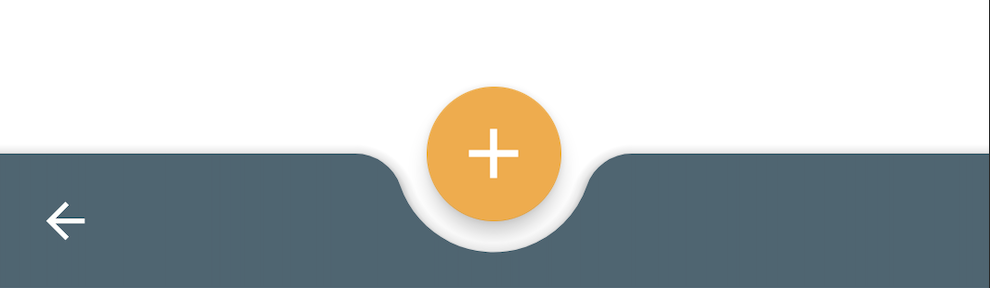
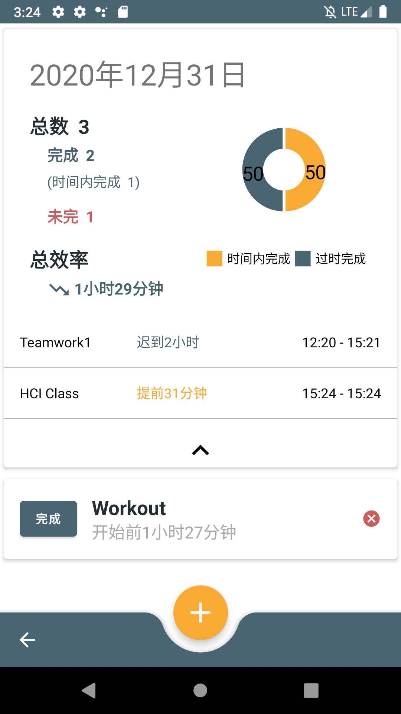
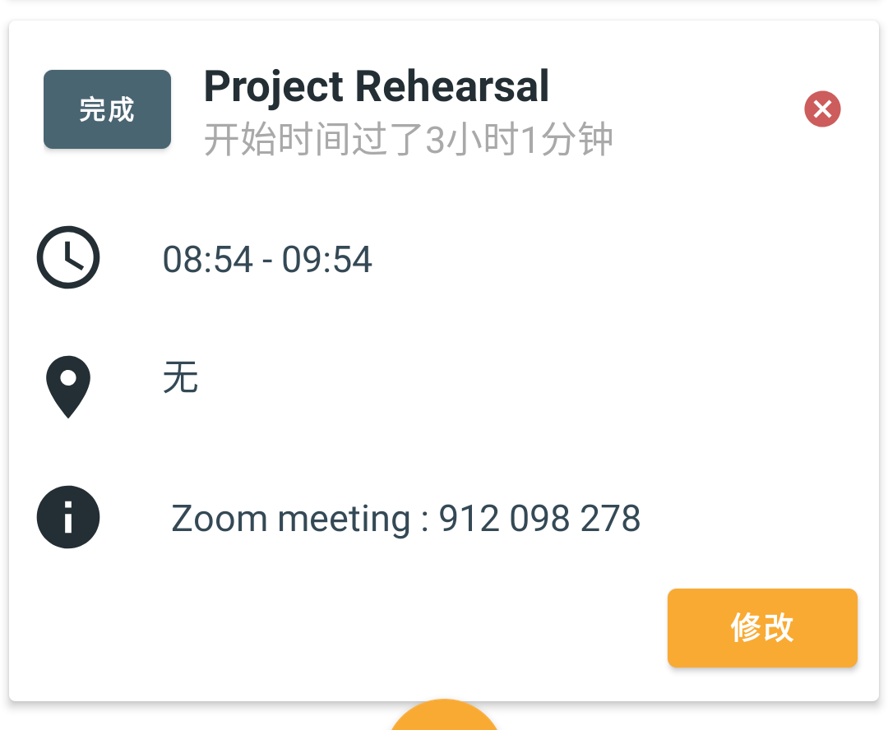
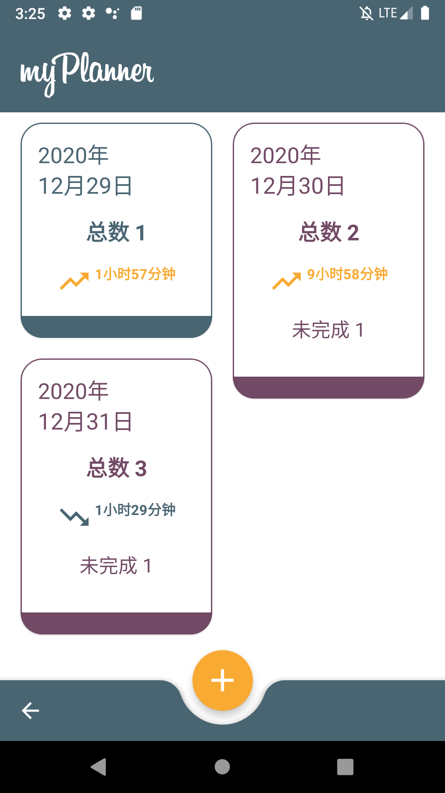
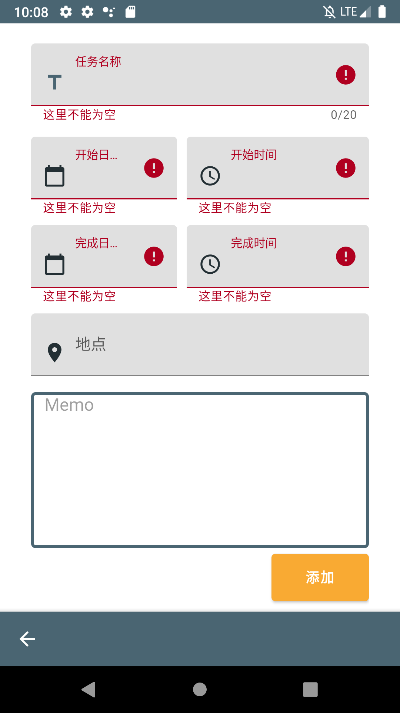
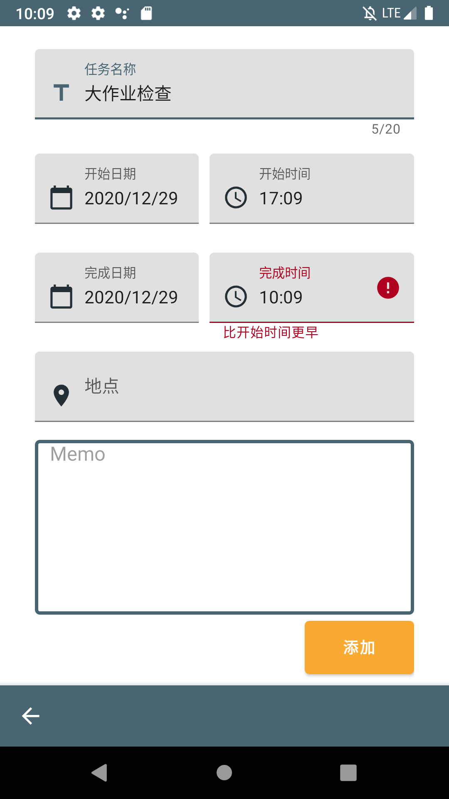
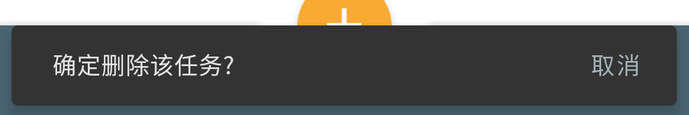

# 人机交互大作业

[1] 实践项目源码 ： （一位项目功能演示）

* 体现对目标用户诉求的深入挖掘，且满足课上所讲各项设计原则，没有明显使人感觉不舒服的体验

  

[2] ppt文档 ： 

* 简单的项目配置说明 

* 个人分工情况

  

[3] 项目需求视频 ：

- 3-5分钟

* 体现以用户为中心的设计思考
* 呈现项目的意义和价值，特别是突出能够帮助用户解决什么问题，即回答用户什么情况下会使用该系统

***

**拍视频作业 ：** 

​	**深入的挖掘 ：什么情况之下，用户可能会去使用您的特定的产品的功能**

​	**思考主题颜色，点缀的颜色也好配置**

**项目拍视频要求：**

​	**挖掘一下你的目标用户到底是什么样子的，什么人最能代表你的产品**

**作业项目关注的重点 ：**

​	**为那些人服务的？那一些人为什么要用你的项目呢？**

***

- 目标用户是啥？ :  大学生

- 目标用户有什么问题？：时间管理，可视性的日程表

- 可以解决目标用户的什么问题？: 

   

***

### 修改的时候参考的设计原理 ： 黄金规则 *by* *Ben Shneiderman*

**规则1. 尽可能保证一致**

- 一致的颜色、布局、字体等

  - 采用Material Design + Tetradic colors 💁🏻  
  - 黑色文字在白色或浅灰色背景下，或者棕色文字在白色背景下具有较好的可读性

- 在任何View都有添加任务和返回按钮

    

  

**规则2. 符合普遍可用性** ❌

**规则3. 提供信息丰富的反馈**

- 提供每一天的进度量和时间使用效率

  

  

- 点击未完成的任务能看到该任务的详细信息

  

**规则4. 设计说明对话框以生成结束信息**

- 一整天的任务View ： 设计为用户只看黄色就认为是正在做得好，灰蓝色就认为正在做得不太好
- 按开始日期的任务View ：设计为用户只看灰蓝色就认为哪一天的任务都完成了，紫色就认为那一天还存在未完成的任务

  

**规则5. 预防并处理错误**

- 为了预防错误，检查输入任务内容而给反馈

    

  

- 点击'完成'或者'删掉'的时候，出现Snackbar预防用户的错误操作

  

  

**规则6. 让操作容易撤销**

- 任务CRUD功能都有

  

**规则7. 支持内部控制点** ❌

**规则8. 减轻短时记忆负担**

- 每个RecyclerView（按开始日期的任务View，一整天的任务View）上尽量显示了3～4个内容
  - Ben Shneiderman -- 人的短期记忆有限于5个
  - 为了用户一眼就能看出任务列表的内容，已经完成任务都合起来在列表的最头部（最头部下列只有未完成任务）

